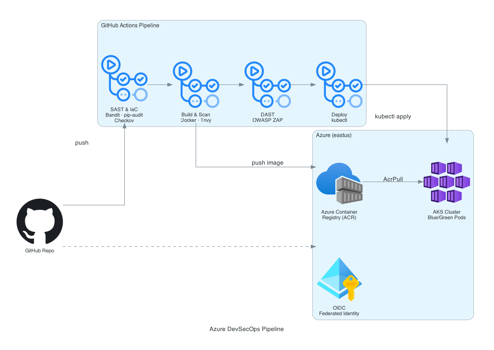

# Azure DevSecOps Pipeline

[](https://github.com/jordann6/azure-devsecops-project/actions/workflows/validate.yml)

End-to-end secure CI/CD pipeline for a containerized Python/Flask app deployed to Azure Kubernetes Service with a blue/green rollout strategy. Security is enforced at every stage before code can reach production — SAST, dependency auditing, IaC scanning, container vulnerability scanning, and DAST all gate the deploy job.

## Architecture



## Pipeline Stages

```
push → SAST & IaC → Build & Trivy Scan → DAST (ZAP) → Deploy to AKS
```

| Stage | Tools | Gate |
|---|---|---|
| **SAST** | Bandit (Python), pip-audit (CVEs), Checkov (Terraform + K8s manifests) | Fails on Medium+ severity |
| **Build & Scan** | Docker multi-stage build, Trivy (CRITICAL/HIGH CVEs) | Fails on unfixed critical/high |
| **DAST** | OWASP ZAP baseline scan against live container | Runs on `main` only |
| **Deploy** | `kubectl apply` with `envsubst` image substitution, rollout status gate | Runs on `main` after DAST passes |

## Infrastructure

| Resource | Name | Notes |
|---|---|---|
| Resource Group | `rg-devsecops-dev` | East US |
| Container Registry | `acrdevsecops{suffix}` (Standard) | `admin_enabled = false` |
| AKS Cluster | `aks-devsecops-dev` | OIDC issuer + workload identity enabled |
| RBAC | AcrPull on ACR | Scoped to AKS kubelet identity |

**AKS security config:** local admin account disabled, AAD RBAC enforced, Azure CNI with network policy, workload identity + OIDC issuer enabled for keyless pod auth.

## Security Hardening

**Container (Dockerfile):**
- Multi-stage build — only compiled artifacts copied to runtime image
- Python 3.13-slim-bookworm runtime
- Non-root user (`appuser`, UID 1000) enforced at image level

**Kubernetes (manifests):**
- `runAsNonRoot: true` + `runAsUser: 1000`
- `allowPrivilegeEscalation: false`
- `readOnlyRootFilesystem: true`
- `capabilities: drop: [ALL]`
- `seccompProfile: RuntimeDefault`
- CPU/memory requests and limits on all containers
- Readiness and liveness probes on `/health`

**CI/CD:**
- Azure OIDC federated identity — no stored credentials
- Image tag = commit SHA, pushed only after Trivy passes
- `envsubst` injects `ACR_LOGIN_SERVER` and `IMAGE_TAG` at deploy time

## Prerequisites

- Azure CLI + `kubectl`
- Terraform >= 1.6
- Docker Desktop (enable `linux/amd64` builds on Apple Silicon)

## Deploy Infrastructure

```bash
az login
cd infra
terraform init
terraform apply
```

After apply, note the `acr_login_server` and `kubernetes_cluster_name` outputs and set them as GitHub Actions repository variables (`ACR_NAME`, `AKS_CLUSTER_NAME`, `RESOURCE_GROUP`).

## Build and Push Manually

```bash
ACR=$(terraform -chdir=infra output -raw acr_login_server)
az acr login --name $(terraform -chdir=infra output -raw acr_name)

docker build --platform linux/amd64 -t ${ACR}/python-app:v1 .
docker push ${ACR}/python-app:v1
```

## Deploy Manifests

```bash
az aks get-credentials \
  --resource-group rg-devsecops-dev \
  --name aks-devsecops-dev

export ACR_LOGIN_SERVER=${ACR} IMAGE_NAME=python-app IMAGE_TAG=v1
envsubst < manifests/blue-deployment.yaml | kubectl apply -f -
kubectl apply -f manifests/service.yaml

kubectl rollout status deployment/python-app-blue
kubectl get service python-app-service  # grab external IP
```

## GitHub Actions Secrets & Variables

| Name | Type | Value |
|---|---|---|
| `AZURE_CLIENT_ID` | Secret | App registration client ID (federated credential) |
| `AZURE_TENANT_ID` | Secret | Azure AD tenant ID |
| `AZURE_SUBSCRIPTION_ID` | Secret | Subscription ID |
| `ACR_NAME` | Variable | ACR name (without `.azurecr.io`) |
| `AKS_CLUSTER_NAME` | Variable | AKS cluster name |
| `RESOURCE_GROUP` | Variable | Resource group name |

## Blue/Green Rollout

Traffic is controlled by the `version` selector on the `python-app-service`:

```bash
# Switch to green
kubectl patch service python-app-service \
  -p '{"spec":{"selector":{"app":"python-app","version":"green"}}}'

# Roll back to blue
kubectl patch service python-app-service \
  -p '{"spec":{"selector":{"app":"python-app","version":"blue"}}}'
```

## Tech Stack

- **App** — Python 3.13, Flask, Gunicorn
- **Container** — Docker multi-stage, python:3.13-slim-bookworm
- **IaC** — Terraform `>= 1.6`, `azurerm ~> 3.100`, Azure Blob remote state
- **Kubernetes** — AKS, blue/green deployments, LoadBalancer service
- **Registry** — Azure Container Registry (Standard, no admin)
- **SAST** — Bandit, pip-audit, Checkov
- **Container scan** — Trivy (Aqua Security)
- **DAST** — OWASP ZAP baseline
- **CI/CD** — GitHub Actions, Azure OIDC federated identity
